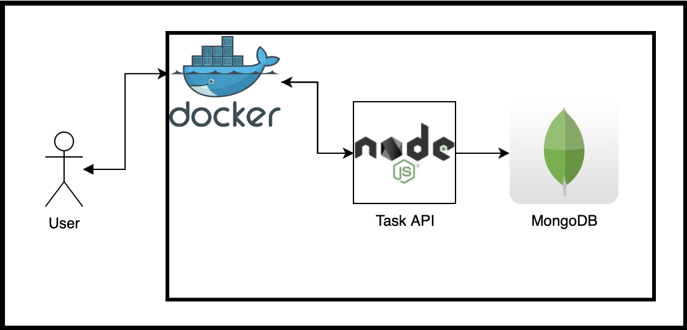

# True North Challenge - Task Repository

## Index

- [Summary](#summary)
  - [Prerequisites](#prerequisites)
- [How this works](#how-this-works)
    - [Architecture](#architecture)
- [Run this sample](#run-this-sample)
- [Run tests](#run-tests)

## Summary

This sample includes a dockerized API which fetchs tasks either from a MongoDB instance or from Lorem-Faker API if tasks where not found.

Additionally, the user can set the completion state of a task.

### Prerequisites

If you are new to Docker or Postman, we recommend reading the following official documentation:

- [Install Docker](https://www.docker.com/products/docker-desktop)
- [Install Postman](https://www.postman.com/downloads/)

## How this works

The task API exposes two endpoints:
- *GET /tasks?numberOfTasks={NUMBEROFTASKS}*
    - User should define the number of tasks desired. If not, the default number of tasks requested will be three.
    - This method will look up the tasks from the MongoDB instance. In case it does not find any task, it will request for new ones accessing the Lorem-faker API, and persists the new tasks into the MongoDB instance to ensure indempotency.
- *PUT /tasks*
    - The user should send a valid task UUID in the request body. The task API will set the task state to `completed`.
    ``` json
    {
        "taskUUID": "b3c56027-3bab-4d04-a969-564389b9c564"
    }
    ```

## Architecture



---

## Run this sample!
- Open a new terminal
- Clone this repository
- Run `docker-compose build`
- Run `docker-compose up`
- Open Postman and test the API at localhost:5050

## Run tests!
- Open a new terminal
- Run `docker-compose up`. Omit this step if the environment is running already.
- Run `docker exec -it true-north-challenge_web npm run test`

